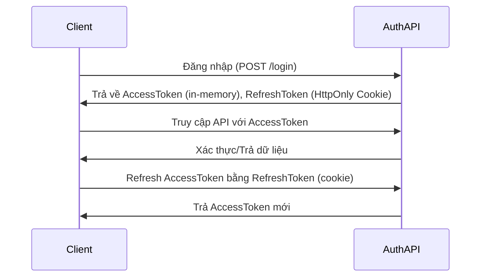

## React TS Auth with Context API
- Branch Zustand auth state

### Key Features
- Global State Management: A custom useAuth hook combined with the Context API makes authentication state (isLoggedIn, user, etc.) accessible to any component in your application. This eliminates prop drilling and simplifies state management.

- In-Memory Access Token: The access token is stored securely in memory, which significantly enhances security by preventing it from being stolen via Cross-Site Scripting (XSS) attacks.

- HttpOnly Cookie Refresh Token: The refresh token is stored in a secure HttpOnly cookie. This makes it inaccessible to client-side JavaScript, providing strong protection against XSS and Cross-Site Request Forgery (CSRF) attacks.

## Authentication Flow Illustrated



### Auth API

This React application requires a backend API for user authentication. Below are the essential endpoints.

-----

### `POST /auth/login`

  * **Description**: This endpoint authenticates a user with their email and password. A successful login returns user details, an **access token**, and sets a secure `HttpOnly` cookie containing the **refresh token**.

  * **Method**: `POST`

  * **Request Body**: A JSON object containing the user's login credentials.

    ```json
    {
      "identifier": "z4@gmail.com",
      "password": "password"
    }
    ```

  * **Response**: Returns a JSON object with the user's details and a JWT access token.

      * **Header**: An `HttpOnly` cookie named `refreshToken` is set.
      * **Body**:

    <!-- end list -->

    ```json
    {
      "user": {
        "id": 16,
        "email": "z4@gmail.com",
        "name": "z4",
        "roles": [
          "ROLE_USER"
        ]
      },
      "accessToken": "jwt_token",
      "expiresIn": 900
    }
    ```

-----

### `POST /auth/refresh`

  * **Description**: This endpoint renews an expired **access token**. It authenticates the request using the **refresh token** stored in the `HttpOnly` cookie and issues a new access token.

  * **Method**: `POST`

  * **Request Body**: No request body is required. The API uses the **refresh token** automatically sent in the `HttpOnly` cookie with the request.

  * **Response**: Returns a JSON object with the same structure as the `/auth/login` endpoint, providing a new access token and its expiration time.

      * **Header**: The `HttpOnly` refresh token cookie may be updated.
      * **Body**:

    <!-- end list -->

    ```json
    {
      "user": {
        "id": 16,
        "email": "z4@gmail.com",
        "name": "z4",
        "roles": [
          "ROLE_USER"
        ]
      },
      "accessToken": "jwt_token",
      "expiresIn": 900
    }
    ```

    ## Development
    - Clone this repo
    - Install dependency
    ```bash
    npm install
    ```
    - Run Frontend app
    ```bash
    npm run dev
    ```
    - Run backend


